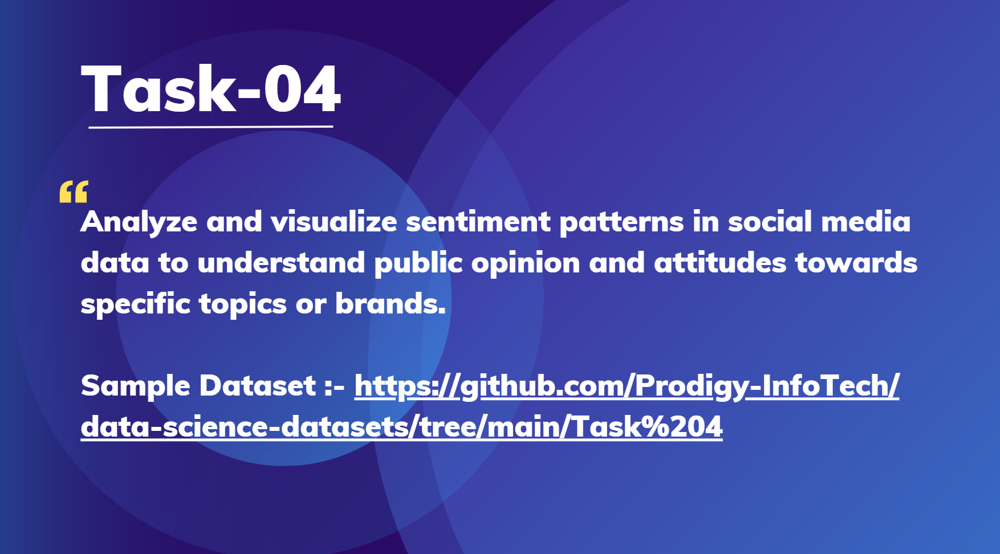

# Prodigy InfoTech Data Science Internship Task 4

   
  

Welcome to my submission for **Task 4** of the Data Science Internship at **Prodigy Infotech**.
In this task, I analyzed and visualized **sentiment patterns in social media data** to understand **public opinion and attitudes** towards specific topics or brands.

---

## 📌 Problem Statement

With the rise of social media, people frequently share their opinions about products, services, and events online. Analyzing these sentiments helps organizations to:

* Track brand perception
* Understand customer feedback
* Make data-driven decisions for marketing and product improvements

The objective of this task is to perform **sentiment analysis** on social media data and visualize the results to identify sentiment trends.

---

## 📊 Dataset

The dataset used is a **Twitter Sentiment Dataset**, provided by Prodigy InfoTech.

👉 [Sample Dataset](https://github.com/Prodigy-InfoTech/data-science-datasets/tree/main/Task%204)

### Features:

* **ID** → Unique identifier of each tweet
* **Entity** → Brand/Topic being discussed
* **Sentiment** → Label (`Positive`, `Negative`, `Neutral`, `Irrelevant`)
* **Tweet** → The text content of the tweet

---

## 🛠 Tools and Libraries Used

The project was carried out in **Python** using **Jupyter Notebook**. The following libraries were used:

* **Pandas & NumPy** → Data cleaning and preprocessing
* **Matplotlib & Seaborn** → Data visualization and charts
* **WordCloud** → Word frequency visualization
* **NLTK, TextBlob, VaderSentiment** → Natural Language Processing & sentiment scoring
* **Scikit-learn** → ML model building (optional)

---

## 🔎 Approach

1. **Data Preprocessing**

   * Removed missing/duplicate values
   * Cleaned tweets by removing stopwords, punctuation, URLs, and special characters
   * Tokenized and lemmatized text for better analysis

2. **Exploratory Data Analysis (EDA)**

   * Checked sentiment distribution (Positive/Negative/Neutral/Irrelevant)
   * Generated WordClouds for each sentiment category
   * Analyzed sentiment distribution across different entities (brands/topics)

3. **Sentiment Analysis**

   * Applied **rule-based sentiment analysis** (TextBlob, VADER)
   * Compared with dataset labels
   * (Optional) Built **classification models** like Logistic Regression or Naive Bayes for sentiment prediction

4. **Visualization**

   * Pie/Bar charts showing sentiment distribution
   * Heatmap for entity vs sentiment comparison
   * WordClouds for positive and negative tweets

---

## 📈 Results

* **Sentiment Distribution:** Most tweets were found to be **Neutral**, followed by Positive and Negative opinions
* **Entity-wise Sentiment:** Certain brands had more **positive engagement**, while others showed more **negative sentiment**
* **WordClouds:** Positive tweets contained words like *“love”, “great”, “amazing”* whereas negative tweets had *“bad”, “worst”, “hate”*

---

## ✅ Conclusion

This task demonstrates how **Sentiment Analysis** can uncover valuable insights from social media data.
By analyzing opinions expressed in tweets, businesses and organizations can:

* Track customer satisfaction
* Identify pain points
* Improve decision-making with **data-driven strategies**

---

👩‍💻 **Developed by:** Akshatha Hosamani
📅 Internship: Prodigy InfoTech – Data Science

